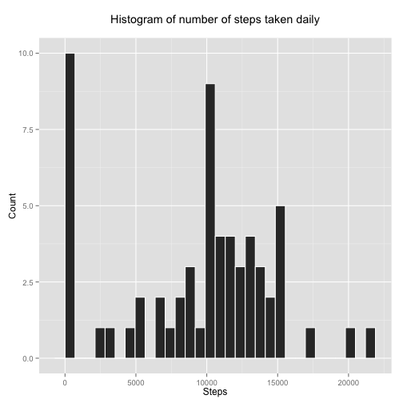
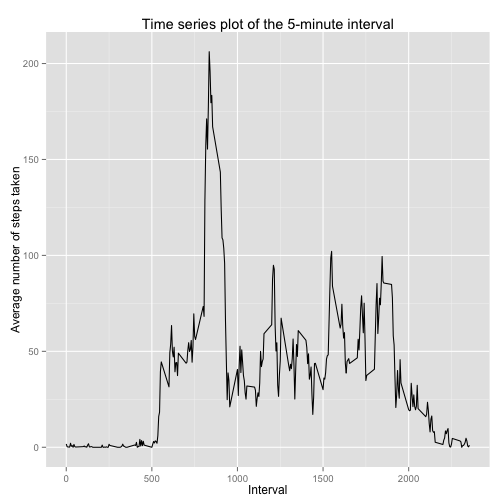
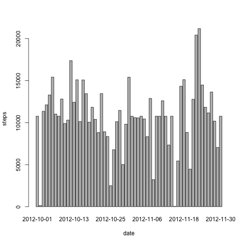

# Reproducible Research: Peer Assessment 1


## Loading and preprocessing the data


```r
data <- read.csv("activity.csv")
data2 <- data[complete.cases(data), 1:2]
library(reshape2)
melted_data <- melt(data2, id.vars="date")
tdset <- dcast(melted_data, date ~ variable, sum)
summary(tdset)
```

```
##          date        steps      
##  2012-10-02: 1   Min.   :   41  
##  2012-10-03: 1   1st Qu.: 8841  
##  2012-10-04: 1   Median :10765  
##  2012-10-05: 1   Mean   :10766  
##  2012-10-06: 1   3rd Qu.:13294  
##  2012-10-07: 1   Max.   :21194  
##  (Other)   :47
```

## What is mean total number of steps taken per day?


```r
barplot(tdset$steps, names.arg = tdset$date, xlab = "date", ylab = "steps")
```

 
### mean number of steps taken per day

```r
mean(tdset$steps)
```

```
## [1] 10766
```
### median number of steps taken per day

```r
quantile(tdset$steps, probs=0.5)
```

```
##   50% 
## 10765
```
## What is the average daily activity pattern?

```r
data3 <- data[complete.cases(data), c("steps", "interval")]
melted_data2 <- melt(data3, id.vars="interval")
tdset2 <- dcast(melted_data2, interval ~ variable, mean)
plot(tdset2, type = "l")
```

 
### Which 5-minute interval contains the maximum number of steps?

```r
tdset2[which(tdset2$steps==max(tdset2$steps)),]$interval
```

```
## [1] 835
```

## Imputing missing values
### total number of missing values in the dataset

```r
sum(!complete.cases(data))
```

```
## [1] 2304
```
### filling missing NAs by the previously calculated mean

```r
newdata <- data
newdata[is.na(newdata)] <- mean(tdset2$steps)
melted_data3 <- melt(newdata[,1:2], id.vars="date")
tdset3 <- dcast(melted_data3, date ~ variable, sum)
head(tdset3)
```

```
##         date steps
## 1 2012-10-01 10766
## 2 2012-10-02   126
## 3 2012-10-03 11352
## 4 2012-10-04 12116
## 5 2012-10-05 13294
## 6 2012-10-06 15420
```

```r
barplot(tdset3$steps, names.arg = tdset3$date, xlab = "date", ylab = "steps")
```

 
### mean number of steps taken per day after filling missing NAs

```r
mean(tdset3$steps)
```

```
## [1] 10766
```
### median number of steps taken per day after filling missing NAs

```r
quantile(tdset3$steps, probs=0.5)
```

```
##   50% 
## 10766
```
The mean does not differ at all from the previous value but median does differ a little bit. So the impact of imputing missing data on the estimates of the total daily number of steps is negligibly small.

## Are there differences in activity patterns between weekdays and weekends?
### Creates a new factor variable with two levels – “weekday” and “weekend” 

```r
daysID <- function(date) {
    if (weekdays(as.Date(date)) %in% c("Saturday", "Sunday")  ) {
        "weekend"
    } 
    else {
        "weekday"
    }
}
newdata$daysID <- as.factor(sapply(newdata$date, daysID))
tail(newdata)
```

```
##       steps       date interval  daysID
## 17563 37.38 2012-11-30     2330 weekday
## 17564 37.38 2012-11-30     2335 weekday
## 17565 37.38 2012-11-30     2340 weekday
## 17566 37.38 2012-11-30     2345 weekday
## 17567 37.38 2012-11-30     2350 weekday
## 17568 37.38 2012-11-30     2355 weekday
```

```r
### Panel plot containing a time series plot of the 5-minute interval 
par(mfrow = c(2, 1))
for (type in c("weekend", "weekday")) {
    steps.type <- aggregate(steps ~ interval, data = newdata, subset = newdata$daysID == 
        type, FUN = mean)
    plot(steps.type, type = "l", main = type)
}
```

 
