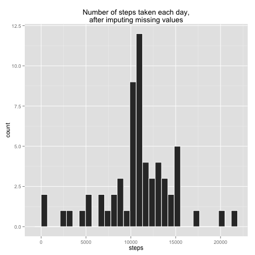

# Reproducible Research: Peer Assessment 1

## Loading and preprocessing the data


```r
data <- read.csv("activity.csv")
library(reshape2)
melted_data <- melt(data, na.rm = TRUE, id.vars="date")
tdset <- dcast(melted_data, date ~ variable, sum)
summary(tdset)
```

```
##          date        steps          interval     
##  2012-10-01: 1   Min.   :    0   Min.   :339120  
##  2012-10-02: 1   1st Qu.: 6778   1st Qu.:339120  
##  2012-10-03: 1   Median :10395   Median :339120  
##  2012-10-04: 1   Mean   : 9354   Mean   :339120  
##  2012-10-05: 1   3rd Qu.:12811   3rd Qu.:339120  
##  2012-10-06: 1   Max.   :21194   Max.   :339120  
##  (Other)   :55
```

## What is mean total number of steps taken per day?


```r
library("ggplot2")
p <- ggplot(tdset, aes(x=steps)) + geom_histogram(colour="white")
p + labs(title='Histogram of number of steps taken daily\n',
       y='Count', x='Steps')
```

```
## stat_bin: binwidth defaulted to range/30. Use 'binwidth = x' to adjust this.
```

 
### mean number of steps taken per day

```r
mean(tdset$steps)
```

```
## [1] 9354
```
### median number of steps taken per day

```r
quantile(tdset$steps, probs=0.5)
```

```
##   50% 
## 10395
```
## What is the average daily activity pattern?

```r
melted_data2 <- melt(data[, c("steps", "interval")], na.rm = TRUE, id.vars="interval")
tdset2 <- dcast(melted_data2, interval ~ variable, mean)
p1 <- ggplot(tdset2, aes(x=interval, y=steps)) + geom_line()
p1 + labs(title='Time series plot of the 5-minute interval',
         y='Average number of steps taken', x='Interval')
```

 
### Which 5-minute interval contains the maximum number of steps?

```r
tdset2[which.max(tdset2$steps), ]$interval
```

```
## [1] 835
```

## Imputing missing values
### total number of missing values in the dataset

```r
sum(!complete.cases(data))
```

```
## [1] 2304
```
### filling missing NAs by the previously calculated mean for the 5-minute interval

```r
tdset2$imputed_steps <- floor(tdset2$steps)
imputed_data <- merge(data, tdset2[,c('interval', 'imputed_steps')], by='interval')
imputed_data$steps <- ifelse(is.na(imputed_data$steps),
                                 imputed_data$imputed_steps,
                                 imputed_data$steps)
imputed_data$imputed_steps <- NULL
sum(is.na(imputed_data))
```

```
## [1] 0
```
### mean number of steps taken per day after filling missing NAs

```r
melted_data3 <- melt(imputed_data, id.vars="date")
daily_imputed_data <- dcast(melted_data3, date ~ variable, sum)
mean(daily_imputed_data$steps)
```

```
## [1] 10750
```
### median number of steps taken per day after filling missing NAs

```r
median(daily_imputed_data$steps)
```

```
## [1] 10641
```
### Replace the data in the original histogram with the imputed data

```r
p %+% daily_imputed_data +
  labs(title='Number of steps taken each day,\nafter imputing missing values')
```

```
## stat_bin: binwidth defaulted to range/30. Use 'binwidth = x' to adjust this.
```

 

The mean does not differ much from the previous value but median does differ a little bit. So the impact of imputing missing data on the estimates of the total daily number of steps is negligibly small.

## Are there differences in activity patterns between weekdays and weekends?
### Creates a new factor variable with two levels – “weekday” and “weekend” 

```r
daysID <- function(date) {
    if (weekdays(as.Date(date)) %in% c("Saturday", "Sunday")  ) {
        "weekend"
    } 
    else {
        "weekday"
    }
}
imputed_data$daysID <- as.factor(sapply(imputed_data$date, daysID))
imputed_data$date <- NULL
table(imputed_data$daysID)
```

```
## 
## weekday weekend 
##   12960    4608
```

```r
### Panel plot containing a time series plot of the 5-minute interval 
par(mfrow = c(2, 1))
for (type in c("weekend", "weekday")) {
    steps.type <- aggregate(steps ~ interval, data = imputed_data, subset = imputed_data$daysID == 
        type, FUN = mean)
    plot(steps.type, type = "l", main = type)
}
```

 
